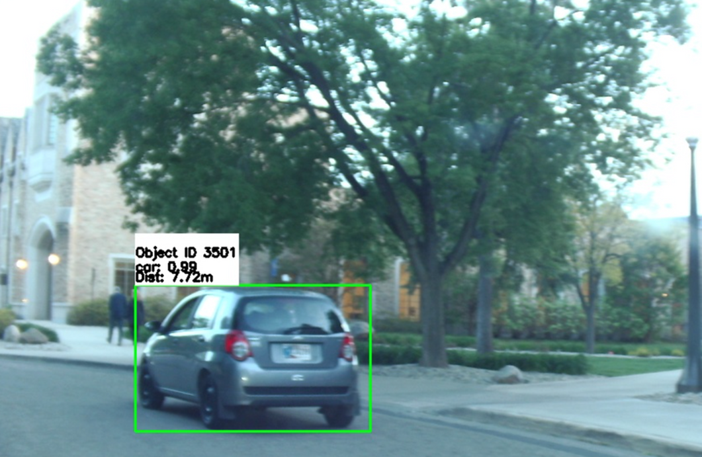
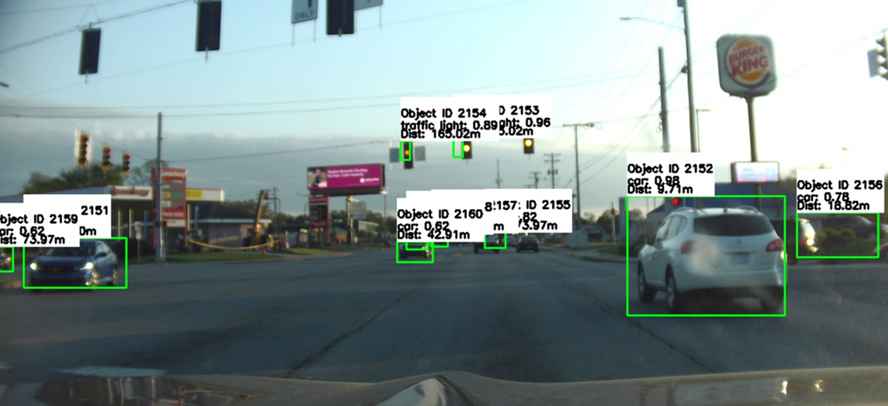
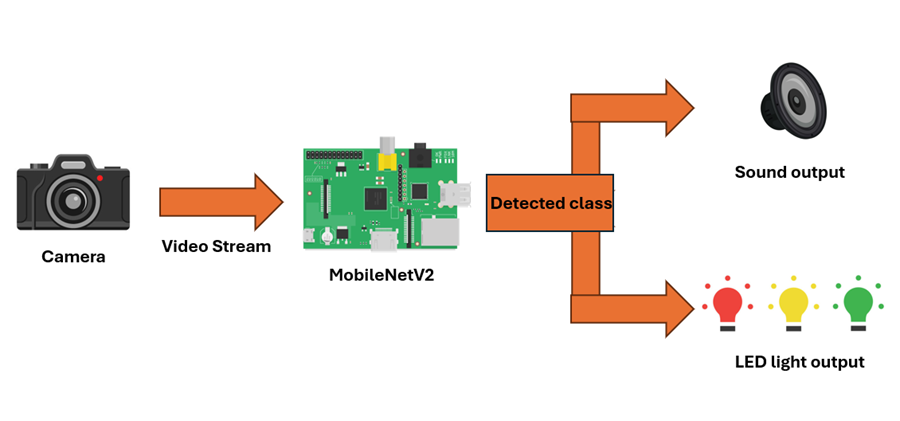
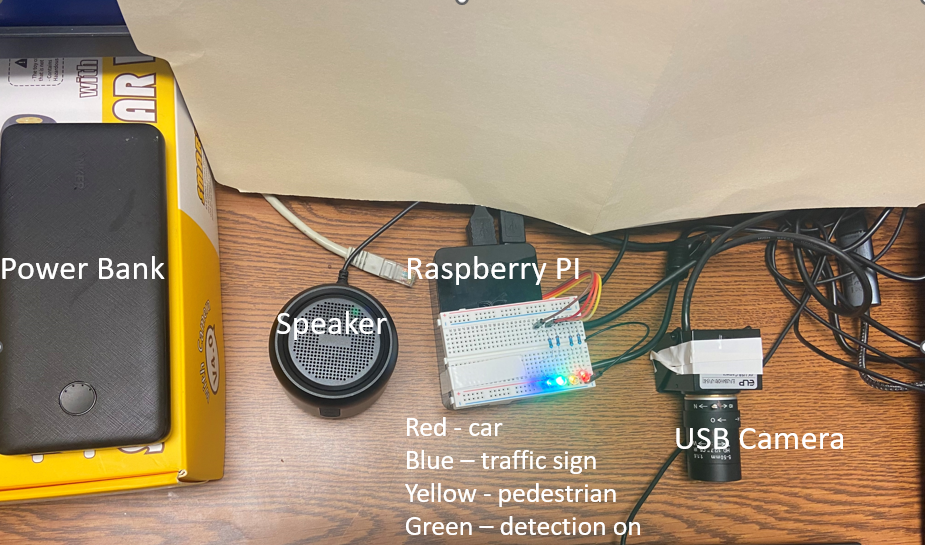

# AI Driver Assistance System

## Project Overview
This project develops a machine learning-powered dashboard camera system on a Raspberry Pi to enhance road safety. It detects nearby objects and alerts the driver with audio and visual warnings, thereby reducing accident risks.

Repository for CSE-60685-CX-01 Machine Learning for Embedded Systems

### Problem Statement
Road traffic accidents are a major cause of fatalities and injuries globally. Despite advancements in vehicle safety, driving environments are increasingly complex. There is a pressing need for enhanced real-time hazard detection systems.

### Solution
Our system utilizes a streamlined Quantized MobileNet V2 model, trained on the COCO dataset and fine-tuned on the BDD-100K dataset, to detect objects within a 120-meter range. It provides timely alerts to drivers using audio (warning sounds) and visual (LED indicators) cues.

Models: MobileNet v2 [https://paperswithcode.com/method/mobilenetv2]

Datasets: COCO + [BDD100k](https://www.vis.xyz/bdd100k/)

## Features
- **Object Detection**: Uses a Quantized MobileNet V2 for real-time object detection.
- **Audio Alerts**: Equipped with a speaker to emit warning sounds when potential hazards are detected.
- **Visual Alerts**: Features LED indicators to provide visual warnings to the driver.
- **High Detection Range**: Capable of detecting objects up to 120 meters away.
- **Low System Latency**: Features an end-to-end latency of less than 200 milliseconds.




## Requirements
- Raspberry Pi 4
- USB-connected Camera
- LED lights
- Speaker for audio alerts
- Power Bank
- Breadboard

## Aplication Pipeline



Input is taken from the USB camera as a VideoStream, then it is processed by the MobileNetV2 model and given a proper class distinction, this happens each frame. If a class is detected the designated sound and light for said class gets activated.

## Hardware Setup
Before starting the installation and running the software, ensure all hardware components are correctly connected to the Raspberry Pi:

1. **Connect the USB camera** to the Raspberry Pi via a USB port.
2. **Attach the wires to the the proper GPIO pins on Raspberry PI -> GPIO 17,18,22,23. A diagram of all available connections can be found under `resources/gpio pins/`
3. **Connect the speaker** for audio alerts to the Raspberry Pi via the audio jack or USB, depending on your speaker's connection interface.
4. **Power Supply**: Ensure that your Raspberry Pi has a suitable power supply to handle all connected devices.


Having done all of this the setup should look something simmilar to this




## Setup and Installation
1. **Clone the Repository:**
```
  git clone https://github.com/Windtwist/Embedded_Systms_Scope.git
```
2. **Navigate to the Project Directory:**
```
  cd Embedded_Systms_Scope
```
3. **Install Dependencies:**
```
  pip install -r requirements.txt
```
4. **Run the Application:**

Make sure to create file for output where images will be stored
```
  python camerafeed2sound.py --modeldir=model --output_path=out
```

## Training
The training for the object detection model can be found in the Jupyter notebook located at `code/training/vehicle_detection.ipynb`. This notebook contains all the steps used to train the Quantized MobileNet V2 on the BDD-100K dataset.

  
## Testing
The system was tested in real-world scenarios as a dashboard system. These tests were essential to ensure the functionality and reliability of the alert system under various driving conditions.

## Challenges
- **Resource Limitations**: The Raspberry Pi 4 has limited CPU and GPU capabilities, which can hinder the real-time processing of complex algorithms.
- **Environmental Impact**: Performance can be affected by environmental conditions such as lighting and glare.
- **Model Bias**: There is an inherent bias towards the 'person' class in the training set -> unequal representation as compared to other classes

## Future Work
- Improve object classification accuracy for traffic signs.
- Refine the distance estimation algorithm for greater camera compatibility.
- Develop more specific audio warnings and integrate more feedback mechanisms.

## License
This project is licensed under the MIT License.

## Authors

- Nnamdi Chikere
- Nathan Gandawa
- Luka Cvetko
